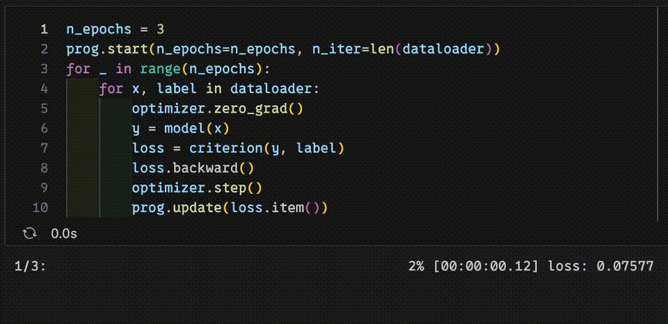

# dlprog

*Deep Learning Progress*

[](https://pypi.org/project/dlprog/)

<br>

A Python library for progress bars with the function of aggregating each iteration's value.  
It helps manage the loss of each epoch in deep learning or machine learning training.



- [PyPI](https://pypi.org/project/dlprog/)
- [API Reference](https://misya11p.github.io/dlprog/)

## Installation

```bash
pip install dlprog
```

## General Usage

Setup

```python
from dlprog import Progress
prog = Progress()
```

Example

```python
import random
import time
n_epochs = 3
n_iter = 10

prog.start(n_epochs=n_epochs, n_iter=n_iter, label='value') # Initialize start time and epoch.
for _ in range(n_epochs):
    for _ in range(n_iter):
        time.sleep(0.1)
        value = random.random()
        prog.update(value) # Update progress bar and aggregate value.
```

```
1/3: ######################################## 100% [00:00:01.06] value: 0.64755 
2/3: ######################################## 100% [00:00:01.05] value: 0.41097 
3/3: ######################################## 100% [00:00:01.06] value: 0.26648 
```

Get each epoch's value

```
>>> prog.values
[0.6475490908029968, 0.4109736504929395, 0.26648041702649705]
```

Call `get_all_values()` method to get all values of each iteration.
And `get_all_times()` method to get all times of each iteration.

## In machine learning training

Setup.   
`train_progress` function is a shortcut for `Progress` class.
Return a progress bar that is suited for machine learning training.

```python
from dlprog import train_progress
prog = train_progress()
```

Example. Case of training a deep learning model with PyTorch.

```python
n_epochs = 3
n_iter = len(dataloader)

prog.start(n_epochs=n_epochs, n_iter=n_iter)
for _ in range(n_epochs):
    for x, label in dataloader:
        optimizer.zero_grad()
        y = model(x)
        loss = criterion(y, label)
        loss.backward()
        optimizer.step()
        prog.update(loss.item())
```

Output

```
1/3: ######################################## 100% [00:00:03.08] loss: 0.34099 
2/3: ######################################## 100% [00:00:03.12] loss: 0.15259 
3/3: ######################################## 100% [00:00:03.14] loss: 0.10684 
```

If you want to obtain weighted exact values considering batch size:

```python
prog.update(loss.item(), weight=len(x))
```

## Advanced usage

Advanced arguments, functions, etc.  
Also, see [API Reference](https://misya11p.github.io/dlprog/) if you want to know more.

### `leave_freq`

Argument that controls the frequency of leaving the progress bar.

```python
n_epochs = 12
n_iter = 10
prog.start(n_epochs=n_epochs, n_iter=n_iter, leave_freq=4)
for _ in range(n_epochs):
    for _ in range(n_iter):
        time.sleep(0.1)
        value = random.random()
        prog.update(value)
```

Output

```
 4/12: ######################################## 100% [00:00:01.06] loss: 0.34203 
 8/12: ######################################## 100% [00:00:01.05] loss: 0.47886 
12/12: ######################################## 100% [00:00:01.05] loss: 0.40241 
```

### `unit`

Argument that multiple epochs as a unit.

```python
n_epochs = 12
n_iter = 10
prog.start(n_epochs=n_epochs, n_iter=n_iter, unit=4)
for _ in range(n_epochs):
    for _ in range(n_iter):
        time.sleep(0.1)
        value = random.random()
        prog.update(value)
```

Output

```
  1-4/12: ######################################## 100% [00:00:04.21] value: 0.49179 
  5-8/12: ######################################## 100% [00:00:04.20] value: 0.51518 
 9-12/12: ######################################## 100% [00:00:04.18] value: 0.54546 
```

### Add note

You can add a note to the progress bar.

```python
n_iter = 10
prog.start(n_iter=n_iter, note='This is a note')
for _ in range(n_iter):
    time.sleep(0.1)
    value = random.random()
    prog.update(value)
```

Output

```
1: ######################################## 100% [00:00:01.05] 0.58703, This is a note 
```

You can also add a note when `update()` as `note` argument.  
Also, you can add a note when end of epoch usin memo() if `defer=True`.

```python
n_epochs = 3
prog.start(
    n_epochs=n_epochs,
    n_iter=len(trainloader),
    label='train_loss',
    defer=True,
    width=20,
)
for _ in range(n_epochs):
    for x, label in trainloader:
        optimizer.zero_grad()
        y = model(x)
        loss = criterion(y, label)
        loss.backward()
        optimizer.step()
        prog.update(loss.item())
    test_loss = eval_model(model)
    prog.memo(f'test_loss: {test_loss:.5f}')
```

Output

```
1/3: #################### 100% [00:00:02.83] train_loss: 0.34094, test_loss: 0.18194 
2/3: #################### 100% [00:00:02.70] train_loss: 0.15433, test_loss: 0.12987 
3/3: #################### 100% [00:00:02.79] train_loss: 0.10651, test_loss: 0.09783 
```

### Multiple values

If you want to aggregate multiple values, set `n_values` and input values as a list.

```python
n_epochs = 3
n_iter = 10
prog.start(n_epochs=n_epochs, n_iter=n_iter, n_values=2)
for _ in range(n_epochs):
    for _ in range(n_iter):
        time.sleep(0.1)
        value1 = random.random()
        value2 = random.random() * 10
        prog.update([value1, value2])
```

Output

```
1/3: ######################################## 100% [00:00:01.05] 0.47956, 4.96049 
2/3: ######################################## 100% [00:00:01.05] 0.30275, 4.86003 
3/3: ######################################## 100% [00:00:01.05] 0.43296, 3.31025 
```

You can input multiple labels as a list instead of `n_values`.

```python
prog.start(n_iter=n_iter, label=['value1', 'value2'])
```

### Default attributes

`Progress` object keeps constructor arguments as default attributes.  
These attributes are used when not specified in `start()`.

Attributes specified in `start()` is used preferentially while this running (until next `start()` or `reset()`).

If a required attribute (`n_iter`) has already been specified, `start()` can be skipped.

### `momentum`

Update values by exponential moving average.

```python
now_values = []
prog.start(n_iter=10, momentum=0.9, defer=True)
for i in range(10):
    prog.update(i)
    now_values.append(prog.now_values())
now_values
```

Output

```
1: ######################################## 100% [00:00:00.01] 3.48678

[0.0,
 0.09999999999999998,
 0.2899999999999999,
 0.5609999999999999,
 0.9048999999999999,
 1.3144099999999999,
 1.7829689999999998,
 2.3046721,
 2.8742048899999997,
 3.4867844009999995]
```

## Version History

### [1.0.0](https://pypi.org/project/dlprog/1.0.0/) (2023-07-13)

- Add `Progress` class.
- Add `train_progress` function.

### [1.1.0](https://pypi.org/project/dlprog/1.1.0/) (2023-07-13)

- Add `values` attribute.
- Add `leave_freq` argument.
- Add `unit` argument.

### [1.2.0](https://pypi.org/project/dlprog/1.2.0/) (2023-09-24)

- Add `note` argument, `memo()` method, and `defer` argument.
- Support multiple values.
- Add `round` argument.
- Support changing separator strings.
- Support skipping `start()`.
- Write API Reference.
- Other minor adjustments.

### [1.2.1](https://pypi.org/project/dlprog/1.2.1/) (2023-09-25)

- Support `note=None` in `memo()`.
- Change timing of note reset from epoch_reset to bar_reset.

### [1.2.2](https://pypi.org/project/dlprog/1.2.2/) (2023-09-25)

- Fix bug that not set `note=None` defaultly in `memo()`.

### [1.2.3](https://pypi.org/project/dlprog/1.2.3/) (2023-11-28)

- Fix bug that argument `label` is not available when `with_test=True` in `train_progress()`.

### [1.2.4](https://pypi.org/project/dlprog/1.2.4/) (2023-11-29)

- Fix bug that argument `width` is not available when `with_test=True` in `train_progress()`.

### [1.2.5](https://pypi.org/project/dlprog/1.2.5/) (2024-01-17)

- Add `get_all_values()` method.
- Add `get_all_times()` method.

### [1.2.6](https://pypi.org/project/dlprog/1.2.6/) (2024-01-18)

- Fix bug that the time (minutes) is not displayed correctly.

### [1.2.7](https://pypi.org/project/dlprog/1.2.7/) (2024-05-10)

- Add `store_all_values` and `store_all_times` arguments.

### [1.2.8](https://pypi.org/project/dlprog/1.2.8/) (2024-06-23, Latest)

- Add `momentum` argument.
- Add `now_values()` method.
